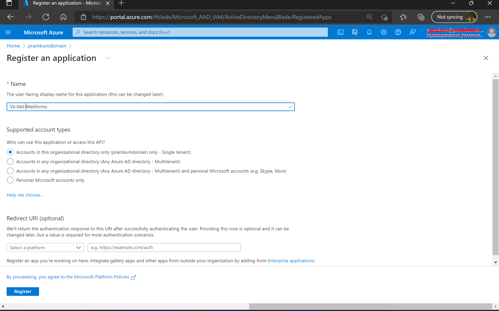
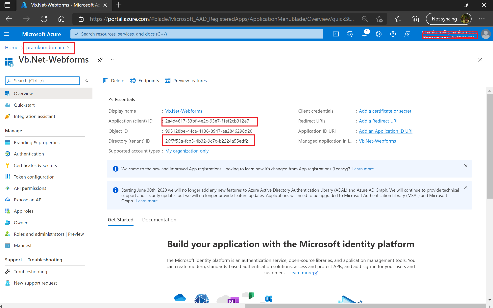
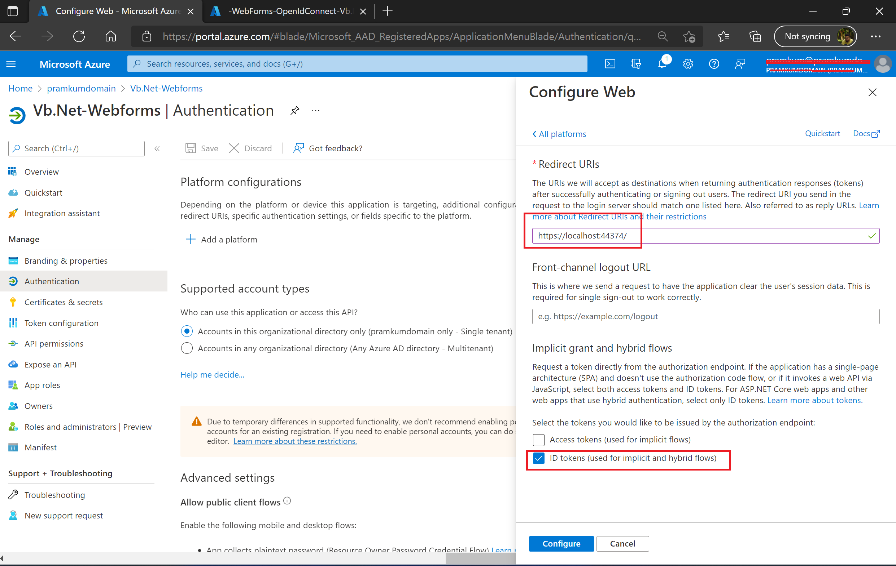
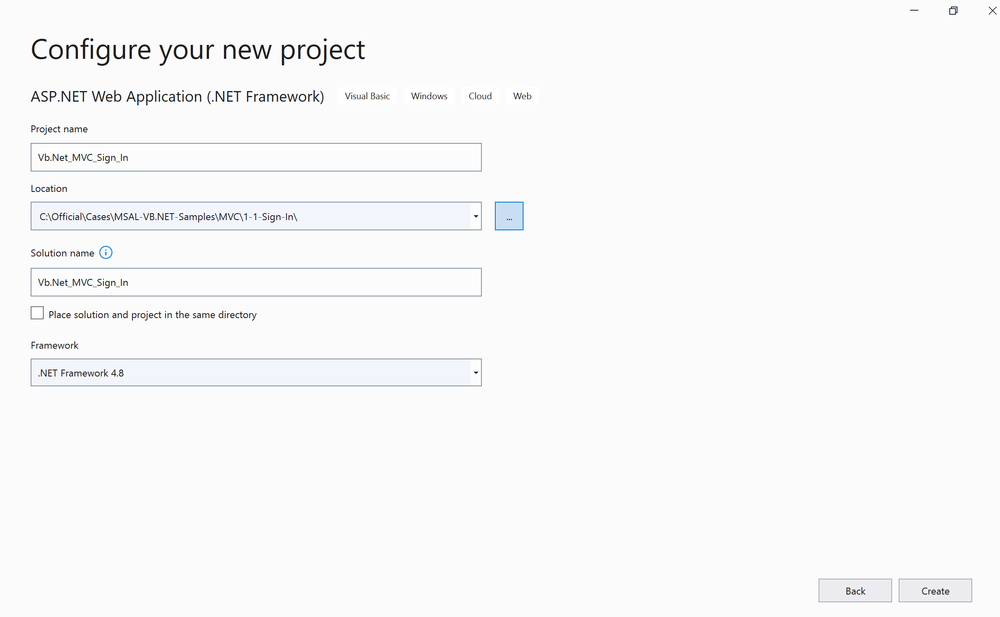
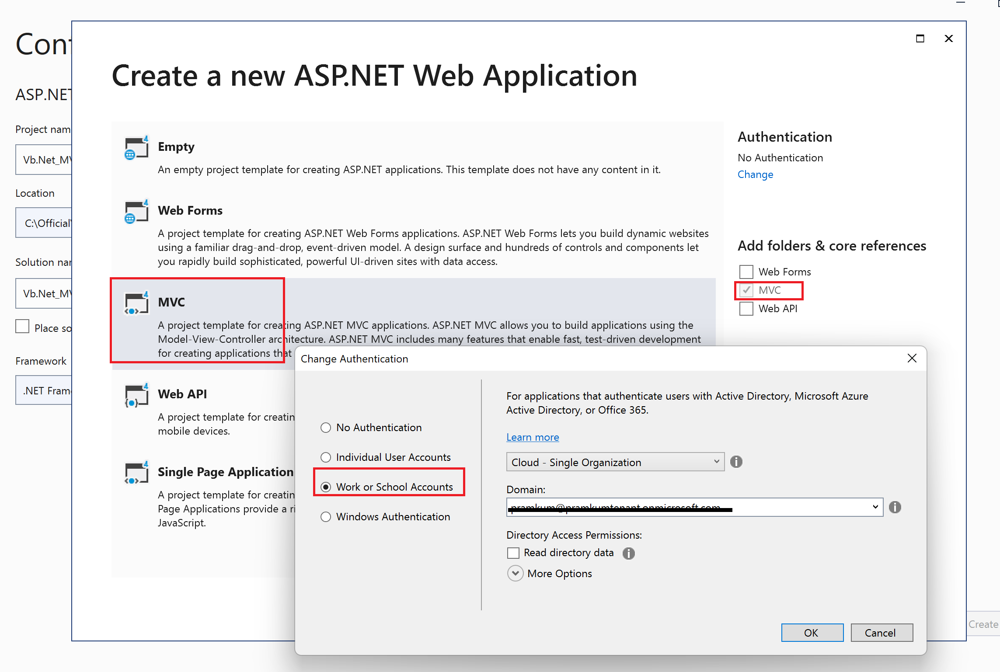

# A VB.NET mvc Web app signing-in users with the Microsoft identity platform in your organization

## Scenario

This sample shows how to build a VB.NET mvc Web app that uses OpenID Connect to sign in users. Users can only sign-in with their `work and school` accounts in their own organization. It leverages the OWIN middleware component.


> This is the first chapter of this ASP.NET Core Web App tutorial. Once you understand how to sign-in users in an ASP.NET Core Web App with Open Id Connect, can learn how to enable your [Web App to call a Web API on behalf of the signed-in user](../../2-WebApp-graph-user) in a later chapter.
  You can also sign-in users in any or several Azure Active Directory organizations, and even with Microsoft personal accounts or social identities. For more details the parent directory's [Readme.md](../Readme.md)

## How to run this sample

> Pre-requisites: Install .NET framework 4.8 (for example for Windows) by following the instructions at [Install .NET Framework for developers](https://docs.microsoft.com/en-us/dotnet/framework/install/guide-for-developers). 

### Step 1: Register the sample with your Azure AD tenant

There is one project in this sample. To register it, you can:

- either use PowerShell scripts that **automatically** creates the Azure AD applications and related objects (passwords, permissions, dependencies) for you and modify the Visual Studio projects' configuration files.

  <details>
  <summary>Expand to see how to use this automation</summary>

    1. On Windows run PowerShell and navigate to the solution's folder

    2. In PowerShell run:

       ```PowerShell
       Set-ExecutionPolicy -ExecutionPolicy RemoteSigned -Scope Process -Force
       ```

    3. Run the script to create your Azure AD application and configure the code of the sample application accordingly

       ```PowerShell
       cd .\AppCreationScripts\ 
   .\Configure.ps1
       ```

       > Other ways of running the scripts are described in [App Creation Scripts](./AppCreationScripts/AppCreationScripts.md)

    4. Open the Visual Studio solution and click start. That's it!

    </details>

- or, if you want to register your application with the Azure portal, follow the steps below:

#### Register the webApp app (WebApp) - Do this step only if you are going with option 1(cloning the repo) in the next section. 

1. Navigate to the Microsoft identity platform for developers [App registrations](https://go.microsoft.com/fwlink/?linkid=2083908) page.
1. Select **New registration**.
1. When the **Register an application page** appears, enter your application's registration information:
   - In the **Name** section, enter a meaningful application name that will be displayed to users of the app, for example `WebApp`.
   - In the **Supported account types** section, select **Accounts in this organizational directory only ({tenant name})**.
     <details open=true>
     <summary>Expand/collapse screenshot</summary>

       

     </details>
     > Note that there are more than one redirect URIs. You'll need to add them from the **Authentication** tab later after the app has been created successfully.
     
1. Select **Register** to create the application.
1. On the app **Overview** page, find the **Application (client) ID** value and record it for later. You'll need it to configure the Visual Studio configuration file for this project.
   <details open=true>
   <summary>Expand/collapse screenshot</summary>

     

   </details>

1. In the list of pages for the app, select **Authentication**..
   - In the Redirect URIs section, select **Web** in the combo-box and enter the following redirect URI.
    - `https://localhost:44300/`          
   - In the **Advanced settings** | **Implicit grant** section, check **ID tokens** as this sample requires
     the [ID Token](https://docs.microsoft.com/azure/active-directory/develop/id-tokens) to be enabled to
     sign-in the user.
     <details open=true>
     <summary>Expand/collapse screenshot</summary>

       

     </details>

1. Select **Save**.

> Note that unless the Web App calls a Web API, no certificate or secret is needed.

### Step 2: Download/ Clone this sample code or build the application using a template

This sample was created from the Visual Studio template and then tweaked to let it support tokens for the Microsoft identity platform endpoint. You can clone/download this repository or create the sample from the Visual Studio directly:

#### Option 1: Download/ clone this sample

You can clone this sample from your shell or command line:

  ```console
git clone https://github.com/PramodKumarHK89/MSAL-VB.NET-Samples.git
Navigate to the correct folder
cd "MVC\1-1-Sign-In\Vb.Net_MVC_Sign_In"
  ```

> Given that the name of the sample is very long, and so are the name of the referenced NuGet packages, you might want to clone it in a folder close to the root of your hard drive, to avoid file size limitations on Windows.

  In the **web.config** file:
  
  - replace the `ida:ClientId` value with the *Application ID* from the application you registered in Application Registration portal on *Step 1*.
  - replace the `ida:TenantId` value with the *Tenant ID* where you registered your Application on *Step 1*.
  - replace the `ida:Domain` value with the *Azure AD domain name*,  e.g. contoso.onmicrosoft.com where you registered your Application on *Step 1*.

#### Option 2: Create the sample from Visual studio

1. Open the Visual studio and create a new project by selecting VB ASP.NET web application as shown in the below screenshot.
    
    
2. Name the project as per your need and select the .NET framework to 4.8. Please refer the below image for reference.
    
    
3. Choose the project type as "mvc". Change the "Authentication" setting from No authentication to "Work or school account" and select the domain where you want to create the app registration. Please do note that, it will automatically create the app registration for you. So, ensure that account with which you are signed-in visual studio has necessary permission to create the app registration in the tenant. 
    

### Step 3: Run the sample

1. Build the solution and run it.

2. Open your web browser and make a request to the app. Accept the IIS Express SSL certificate if needed. The app immediately attempts to authenticate you via the identity platform endpoint. Sign in with your personal account or with work or school account.
